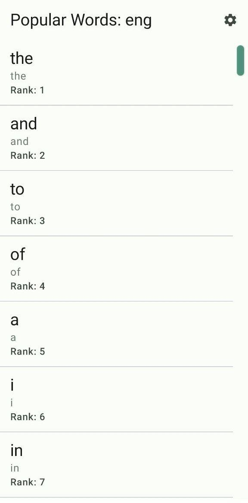
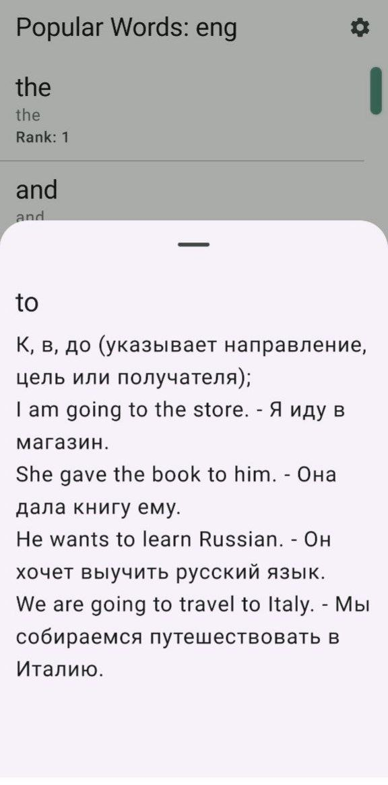
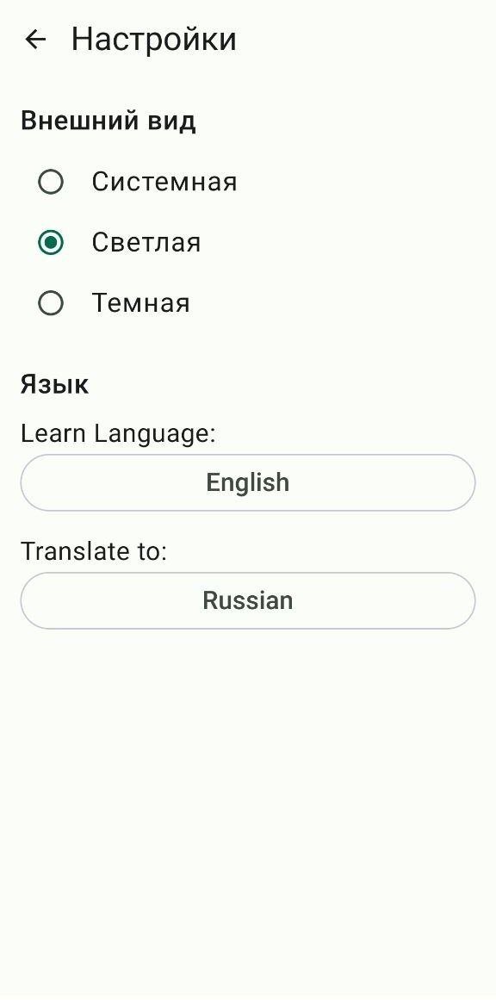
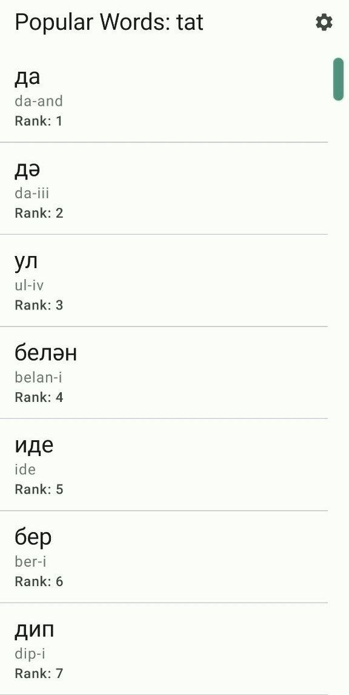
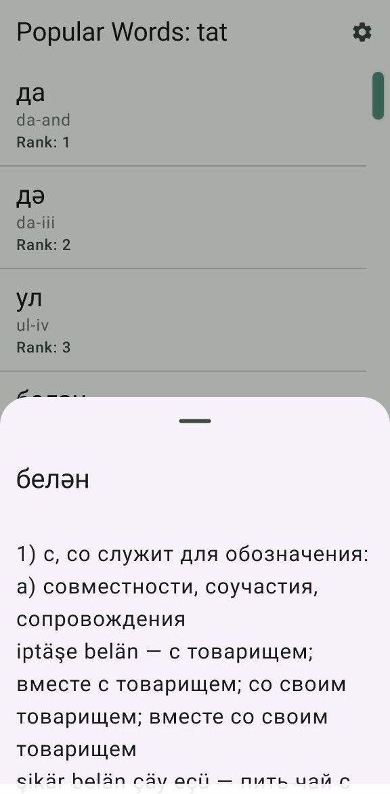
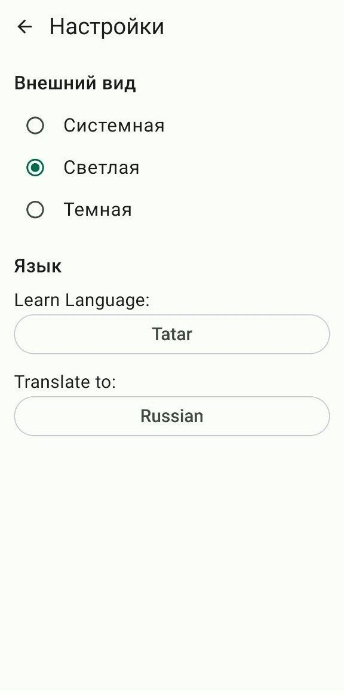

## Screens:

|            Word List (by frequency)            | Word Meanings | Settings |
|:----------------------------------------------:| :---: | :---: |
|  |  |  |
|  |  |  |

## Источник данных:
Данные предоставлены через API [speak.tatar](https://speak.tatar).
> [!NOTE]
> Это приложение является неофициальным клиентом. Все лингвистические данные (слова, значения, примеры) принадлежат их законным владельцам и проекту speak.tatar.

## Download:

[apk](https://github.com/gmars1/langs_kmp__pb/edit/master/apks/androidApp-debug.apk)
---
